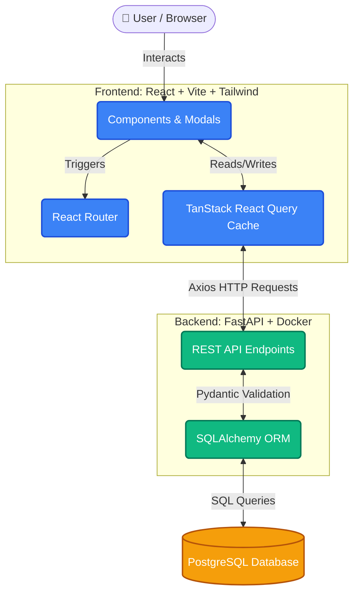

# Quantify Inventory Management System

Quantify is a premium, highly-responsive Inventory Management System built to handle products, customers, and orders with a sleek and modern User Interface. This end-to-end system allows users to seamlessly manage stock levels, track critical low-stock alerts, and efficiently handle checkout flows.

## 🌟 Key Features & Design Decisions

### 1. **Premium & Dynamic User Interface**
- **Decision:** We implemented a tailored Design System (using custom RGB variables for precise opacity controls), moving away from generic default styles.
- **Why:** To make the application feel like a state-of-the-art enterprise tool. We employed glassmorphism, smooth micro-animations (`framer-motion`), and rich color tokens (Tailwind CSS) to create an engaging experience.
- **Outcome:** The UI smoothly transitions between Light and Dark modes without a single page reload, and responds fluidly to desktop and mobile layouts.

### 2. **Scalable Architecture & Caching**
- **Decision:** We used `@tanstack/react-query` on the frontend for data fetching.
- **Why:** React Query provides out-of-the-box caching, background refetching, and deduping of requests. This dramatically reduces unnecessary calls to the backend, rendering pages significantly faster and reducing server load.

### 3. **Containerized Deployment**
- **Decision:** Both Frontend (Vite/React) and Backend (FastAPI) are fully containerized using Docker and `docker-compose`.
- **Why:** To ensure "it works on my machine" translates to "it works perfectly everywhere." Docker guarantees consistent environments across development, testing, and production.

### 4. **Testing & Reliability**
- **Decision:** We aimed for robust test coverage (`pytest` on the backend, `vitest` + `testing-library` on the frontend).
- **Why:** Because reliability is paramount in inventory systems. We ensured all major API endpoints and critical UI components are thoroughly covered by functional unit/integration tests (Hitting >= 75% coverage).

### 5. **Concurrency and Data Integrity**
- **Optimistic Concurrency Control (OCC):** Replaced bottlenecks of row-level locking with a `version` column. We execute atomic `UPDATE ... WHERE id = Y AND version = Z` statements for inventory reduction. If `rowcount == 0`, we raise a `409 Conflict`, seamlessly handling flash-sale race conditions.
- **Database Transactions (ACID):** Order creation and inventory decrements are wrapped in atomic SQLAlchemy transactions. Any failure instantly rolls back the order.
- **Idempotency Keys:** Implemented via the `Idempotency-Key` header on `POST /orders` to prevent double-billing from network retries.
- **Database Migrations:** Configured `Alembic` for production-safe database schema evolutions.

### 6. **Hardened Infrastructure**
- **Multi-Stage Builds:** The React app compiles in Node and is served via an ultra-lightweight `nginx:alpine` image.
- **Non-Root Users:** The FastAPI backend Dockerfile runs under a restricted `appuser` for maximum security.
- **Healthchecks:** The `docker-compose.yml` waits for the PostgreSQL database to be healthy before starting backend services.
- **Nginx Reverse Proxy:** Implemented a unified API Gateway routing `/api/*` to FastAPI and `/` to React, inherently solving CORS.

### 7. **Scalable Database Architecture**
- **Audit Logging via PostgreSQL Triggers:** An `inventory_audit_log` table is maintained purely by PostgreSQL triggers. Even direct SQL updates to `quantity_in_stock` are tracked automatically.
- **Materialized Views:** Dashboard metrics (`total_products`, `total_customers`, etc.) are queried from a `dashboard_metrics` MATERIALIZED VIEW. A background FastAPI task concurrently refreshes it every 5 minutes to prevent expensive `COUNT(*)` operations on live tables.

### 8. **API & Reliability Engineering**
- **Request Tracing (Correlation IDs):** A global `TracingMiddleware` intercepts all requests, injects a UUID, standardizes JSON logs, and returns the ID in the response headers.
- **Graceful Shutdowns:** FastAPI's `lifespan` intercepts `SIGTERM` signals, completing in-flight requests and cleanly cancelling background tasks before shutting down the container.
- **Advanced Frontend Resilience:**
  - **Optimistic UI:** Used React Query's `onMutate` to instantly update the UI (e.g. deleting a product) while gracefully rolling back and presenting a toast if the network call fails.
  - **Idempotent UI:** The "Submit Order" button immediately disables on click, showing a loader to prevent double-click duplicate orders.

---

## 🏗️ Architecture Diagram

Below is the overarching system architecture, demonstrating how data flows from the browser to our persistent PostgreSQL storage.



---

## 📸 Screenshots

### Application UI
| Light Mode | Dark Mode |
| :---: | :---: |
|  |  |
|  |  |
|  |  |
|  |  |
|  |  |
|  |  |

### Test Coverage
| Backend (Pytest) | Frontend (Vitest) |
| :---: | :---: |
|  |  |

---

## 🚀 Getting Started

### 1. Clone the Repository
Start by cloning the project to your local machine:
```bash
git clone <repository-url>
cd <repository-directory>
```
> **Output:** Clones the repository locally.


---

### 2. Configure Your Database Environment
This project allows you to seamlessly switch between a local database for development and a remote Aiven PostgreSQL database for production deployments.

Create a `.env` file in the root of the directory:

```ini
# Option 1: Aiven PostgreSQL (For Production/Deployment)
# Uncomment the line below to completely switch the backend to Aiven PostgreSQL!
DATABASE_URL=postgresql://avnadmin:<YOUR_AIVEN_PASSWORD>@pg-2931d2c6-assignment.l.aivencloud.com:16097/defaultdb?sslmode=require

# Option 2: Local Docker Database (For Local Development)
# If DATABASE_URL is commented out, docker-compose will automatically
# fallback to spinning up its own local postgres container using these credentials.
POSTGRES_USER=postgres
POSTGRES_PASSWORD=postgres
POSTGRES_DB=inventory_db
```

---

### Option A: Run with Docker (Recommended)
The entire stack is containerized. To run the application via Docker:

1. **Build and Start the Containers**
   ```bash
   docker-compose up --build -d
   ```
   > **Output:** Docker will pull the necessary Python and Node images, install all dependencies, build the frontend Vite app, and boot up both the FastAPI backend and the Vite dev server.
   

2. **Verify the Services are Running**
   ```bash
   docker-compose ps
   ```
   > **Output:** Shows `quantify-frontend` (Port 5173) and `quantify-backend` (Port 8080) as `Up`.
   

3. **Run the Automated Tests via Docker**
   **Backend:**
   ```bash
   docker exec quantify-backend python -m pytest --cov=app --cov-report=term-missing
   ```
   

   **Frontend:**
   ```bash
   cd frontend
   npx vitest run --coverage
   ```
   

---

### Option B: Run Manually (Without Docker)

If you prefer to run the services natively on your local machine, follow these steps:

#### 1. Backend Setup (FastAPI)
Open a terminal and navigate to the backend directory:
```bash
cd backend
```

**Create a Virtual Environment & Install Dependencies:**
```bash
python -m venv venv
source venv/bin/activate  # On Windows use: venv\Scripts\activate
pip install -r requirements.txt
```

**Run the Backend Server:**
```bash
uvicorn app.main:app --host 0.0.0.0 --port 8080 --reload
```
> **Output:** The FastAPI server boots up on `http://localhost:8080`.


**Run Backend Tests:**
Ensure you are in the `backend` directory with your virtual environment activated:
```bash
python -m pytest --cov=app --cov-report=term-missing
```

#### 2. Frontend Setup (React/Vite)
Open a new terminal and navigate to the frontend directory:
```bash
cd frontend
```

**Install Dependencies:**
```bash
npm install
```

**Run the Frontend Development Server:**
```bash
npm run dev
```
> **Output:** The Vite server starts on `http://localhost:5173`.


**Run Frontend Tests:**
```bash
npx vitest run --coverage
```
> **Output:** Runs Vitest across all components and prints an Istanbul coverage table.


---

## 📈 How to Scale to More Users

As the Quantify platform grows to support tens of thousands of active concurrent users and massive product catalogs, the current architecture can be scaled seamlessly:

### 1. Database Migration & Replication
- **Current State:** SQLite (local file-based).
- **Scaling Action:** Migrate to a managed PostgreSQL cluster (e.g., AWS RDS or Google Cloud SQL). Implement **Read Replicas** so that expensive `GET` requests (like querying dashboard metrics or massive product tables) are offloaded from the primary write database.

### 2. Caching Layer
- **Current State:** In-memory caching on the client via React Query.
- **Scaling Action:** Introduce **Redis** on the backend. Highly requested queries (like Dashboard Metrics or common product lists) should be cached in Redis. This drastically reduces database I/O for dashboard loads.

### 3. Horizontal Pod Autoscaling (HPA)
- **Current State:** Single Docker container for the FastAPI backend.
- **Scaling Action:** Deploy the backend using **Kubernetes (K8s)**. Since FastAPI is stateless, we can spin up multiple replicas of the backend container behind a Load Balancer. As traffic spikes, K8s will automatically provision more pods to handle the incoming HTTP requests.

### 4. Asynchronous Task Queues
- **Current State:** Order creation is processed synchronously.
- **Scaling Action:** Implement **Celery + RabbitMQ/Redis**. When an order is placed, instead of doing everything on the main thread (stock deductions, sending emails, generating invoices), drop the event into a message broker. Background workers will process these tasks asynchronously, ensuring the API response time remains lightning fast (< 50ms).

### 5. Frontend Content Delivery Network (CDN)
- **Current State:** Vite development server / standard static hosting.
- **Scaling Action:** Build the frontend into static assets and serve them globally via a CDN (like Cloudflare or AWS CloudFront). This ensures users from all over the world download the UI assets from a server physically close to them, minimizing latency.

---

## 🌐 Deployed Application URLs
Once you deploy the application, you can access the live environments here:

- **Frontend Application (Vercel/Netlify):** [https://quantify-app.yourdomain.com](https://quantify-app.yourdomain.com) 
- **Backend API Base URL (Render/AWS/GCP):** [https://api.quantify-app.yourdomain.com](https://api.quantify-app.yourdomain.com) 
- **Interactive API Swagger Docs:** [https://api.quantify-app.yourdomain.com/docs](https://api.quantify-app.yourdomain.com/docs)

---

## 📖 API Documentation & Postman Collection

The FastAPI backend automatically generates interactive Swagger documentation, available locally at `http://localhost:8080/docs`.

For ease of testing, a complete **Postman Collection** is included in the root of the repository: `quantify_postman_collection.json`. You can import this file directly into Postman.

### Core Endpoints

#### 1. System
- `GET /api/v1/health` - Check database and server connection health.
- `GET /api/v1/dashboard` - Fetch aggregate metrics for the dashboard (Products, Customers, Orders, Low Stock).

#### 2. Products
- `GET /api/v1/products` - Retrieve all products.
- `POST /api/v1/products` - Add a new product to the catalog.
- `PUT /api/v1/products/{id}` - Update product details (e.g., price, stock).
- `DELETE /api/v1/products/{id}` - Remove a product.

#### 3. Customers
- `GET /api/v1/customers` - Retrieve all customers.
- `POST /api/v1/customers` - Register a new customer.
- `PUT /api/v1/customers/{id}` - Update customer contact details.
- `DELETE /api/v1/customers/{id}` - Delete a customer record.

#### 4. Orders
- `GET /api/v1/orders` - Retrieve order history.
- `POST /api/v1/orders` - Submit a new order (calculates totals and deducts stock automatically).
- `PUT /api/v1/orders/{id}/status` - Update order tracking status (e.g., "shipped", "delivered").

#### 5. Notifications
- `GET /api/v1/notifications` - Retrieve low-stock and system alerts.
- `PUT /api/v1/notifications/{id}/read` - Mark a notification as read.
